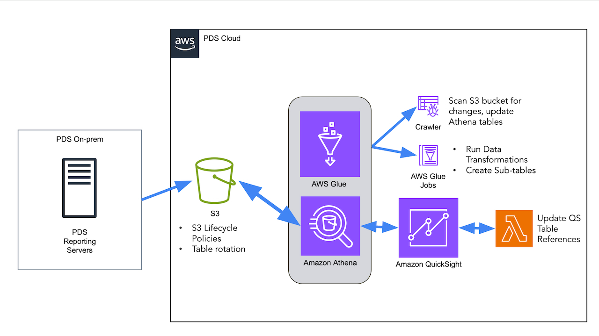

# PDS Web Analytics
This repo contains code, configuration, and other artifacts related to the PDS 
Web Analytics platform using Athena, Glue, and QuickSight. 

## Quick Start
It is highly recommended to use Conda environments for running the code in this 
repository. This documentation will assume use of Anaconda and Conda virtual 
environments. 

### Prerequisites
- [Anaconda](https://www.anaconda.com/products/individual)
- [AWS CLI](https://aws.amazon.com/cli/)

Python 3.9.x is utilized throughout this repo and has been developed on CentOS 7.9. 
It will most likely work in any Unix/Linux environment with any reasonably recent 
version of Python, but has not been extensively tested on other environments and 
distributions.

### Supporting Docs
- [Conda Cheat Sheet](https://docs.conda.io/projects/conda/en/latest/user-guide/cheat-sheet.html)
- [Conda Environment Files](https://docs.conda.io/projects/conda/en/latest/user-guide/tasks/manage-environments.html#creating-an-environment-from-an-environment-yml-file)
- [AWS CLI Configuration](https://docs.aws.amazon.com/cli/latest/userguide/cli-configure-quickstart.html)

## Installation Steps
1. Ensure prerequisites are installed.
   1. Install Anaconda.
   1. Following instructions to set up Conda environment will install everything else.
1. Clone this repository to your local machine.
1. Navigate to the repository's root directory.
1. Create a new Conda environment using the provided `environment.yml` file:
    ```bash
    conda env create -f environment.yml
    ```
1. Activate the new environment:
    ```bash
    conda activate pds-web-analytics
    ```
You're now set up to run the code in this repository.

## PDS Web Analytics System, Architecture, and Data Flow



PDS Web Analytics is designed to process and visualize web traffic
data from web logs produced from the PDS Nodes. This system is built on the following AWS services:

- **AWS S3**: store raw log files (Apache Common Log Format (CLF)) from the PDS reporting server.
- **AWS Glue**: Used to crawl new logs and store them in a format that can be queried by Athena.
- **AWS Athena**: Used to query processed log files and generate backend tables.
- **AWS QuickSight**: Data visualization tool used to create dashboards and reports.
- **AWS CloudWatch**: Used to monitor and manage the system.
- **AWS Lambda**: Used to automate tasks and manage the system.


### S3 Log Sync
This script syncs log files from PDS reporting server to AWS S3 bucket to be 
later processed by AWS Glue. The script is designed to be run as a cron job on 
the reporting server.

#### Usage
Ensure that tokens to allow access to the S3 bucket are configured correctly in
your environment to run this script. This script will not work properly without
proper AWS credentials. Please contact your system administrator for help with 
this.

1. Before the script can be run, you'll need to set up a configuration file. A 
template is provided in this repository at `config/config_example.yaml`: 
   ```yaml
   log_directory: /log/directory
   profile_name: profile-reference
   s3_bucket: s3-bucket
   s3_logdir: log-dir
   subdirs:
     node:
       subdir-htp:
         include:
           - "example*"
   ```
1. Once you have a configuration file set up, you can run the script:
   ```bash
   python s3_log_sync.py -c config/config.yaml
   ```
If run manually, the script will sync all log files from the specified directory
and produce output to stdout.

