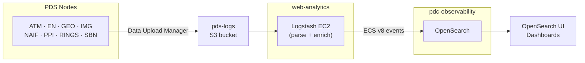

# PDS Web Analytics

A comprehensive web analytics system for the Planetary Data System (PDS) that processes and analyzes web access logs from multiple PDS nodes using Logstash, OpenSearch, and AWS services.

## Overview

This system ingests web access logs from various PDS nodes (ATM, EN, GEO, IMG, NAIF, PPI, RINGS, SBN) and processes them through a Logstash pipeline to extract meaningful analytics data. The processed data is stored in OpenSearch for visualization and analysis.

* [Overview](#overview)
  + [Key Features](#key-features)
* [Architecture](#architecture)
* [Prerequisites](#prerequisites)
* [Installation](#installation)
* [Package Structure](#package-structure)
* [Configuration](#configuration)
* [Usage](#usage)
  + [S3 Log Synchronization](#s3-log-synchronization)
  + [Logstash Processing](#logstash-processing)
  + [Testing](#testing)
  + [Monitoring](#monitoring)
  + [Adding Tests for New Log Formats](#adding-tests-for-new-log-formats)
* [Data Processing Overview](#data-processing-overview)
  + [Supported Log Formats](#supported-log-formats)
  + [ECS Field Mapping](#ecs-field-mapping)
  + [Error Handling](#error-handling)
* [PDS Node Support](#pds-node-support)
* [Development](#development)
* [Troubleshooting](#troubleshooting)
* [License](#license)
* [Support](#support)
* [Changelog](#changelog)

### Key Features

- **Multi-format Log Processing**: Supports Apache Combined, IIS, FTP, and Tomcat log formats
- **ECS v8 Compliance**: All data is structured according to Elastic Common Schema v8
- **Comprehensive Error Handling**: Bad logs are tagged and stored separately for analysis
- **Geographic IP Resolution**: Automatic geolocation and reverse DNS lookup
- **User Agent Analysis**: Bot detection and user agent parsing
- **Test Framework**: Automated testing with sample log data
- **AWS Integration**: S3 log ingestion and OpenSearch output
- **Environment Variable Support**: Configuration via environment variables with envsubst
- **Flexible AWS Profile**: Support for AWS_PROFILE environment variable
- **Native boto3 S3 Uploads**: S3 log sync now uses boto3 (no AWS CLI required for S3 uploads)

## Architecture


```mermaid
flowchart LR
    subgraph pds["PDS Nodes"]
        N["ATM · EN · GEO · IMG\nNAIF · PPI · RINGS · SBN"]
    end

    S3["pds-logs\nS3 bucket"]

    subgraph wa["web-analytics"]
        LS["Logstash EC2\n(parse + enrich)"]
    end

    subgraph obs["pdc-observability"]
        OS["OpenSearch"]
    end

    DASH["OpenSearch UI\nDashboards"]

    N -->|"Data Upload Manager"| S3
    S3 --> LS
    LS -->|"ECS v8 events"| OS
    OS --> DASH
```

PDS nodes upload access logs to a shared `pds-logs` S3 bucket using Data Upload Manager. Logstash polls S3, parses logs into ECS v8 format, and writes to OpenSearch. OpenSearch is a shared platform managed in [pdc-observability](https://github.com/NASA-PDS/pdc-observability) — both this pipeline and [cloudfront-realtime-monitor](https://github.com/NASA-PDS/cloudfront-realtime-monitor) write to it. Analysts query via OpenSearch Dashboards.

## Prerequisites

### Production deployment on AWS

See [`terraform/README.md`](terraform/README.md) for the full step-by-step deployment guide. Infrastructure runs on an MCP Amazon Linux 2023 EC2 with Logstash installed via RPM and managed by systemd. Access is via AWS Systems Manager (SSM) — no SSH keys or special EC2 users required.

### Local development and testing

- **Python 3.13+** — for the s3-sync tool and unit tests
- **Docker** — for running integration tests without a local Logstash install
- **AWS credentials** — via `~/.aws/credentials`, environment variables, or IAM role
- **envsubst** — for generating Logstash pipeline configs locally (part of `gettext`)

```bash
# macOS
brew install gettext

# Amazon Linux / RHEL / CentOS
sudo dnf install gettext
```

## Installation

### 1. Clone the Repository
```bash
git clone https://github.com/NASA-PDS/web-analytics.git
cd web-analytics

# Create WEB_ANALYTICS_HOME environment variable
echo 'export WEB_ANALYTICS_HOME="$(pwd)"' >> ~/.bashrc
source ~/.bashrc
```

### 2. Set Up Python Environment
```bash
# Create and activate virtual environment
python3 -m venv venv
source venv/bin/activate  # On Windows: venv\Scripts\activate

# Install the package in development mode (dependencies will be installed automatically)
pip install -e .
```

**Note**: A legacy `environment.yml` file is provided for users who prefer conda, but the recommended approach is to use Python virtual environments with the package's setup.cfg configuration.

### 3. Configure Environment Variables

Copy `.env.example` to `.env` and fill in values:

```bash
cp .env.example .env
```

```ini
S3_BUCKET_NAME=your-pds-logs-bucket
S3_CF_BUCKET_NAME=               # CloudFront logs bucket (EN only); leave empty to skip
OPENSEARCH_URL=https://your-opensearch-domain.us-west-2.es.amazonaws.com
INDEX_PREFIX=pds-web-analytics
AWS_REGION=us-west-2
```

Then source it before running scripts locally:

```bash
set -a; source .env; set +a
```

### 4. Build Logstash Pipeline Configs (local only)

On the EC2, `logstash-deploy.sh` does this automatically. For local dev:

```bash
set -a; source .env; set +a
LS_SETTINGS_DIR=$(pwd)/config/logstash/config ./scripts/logstash_build_config.sh
```

This generates `config/logstash/config/pipelines.yml` and one `.conf` file per PDS node under `config/logstash/config/pipelines/`.

#### 5. Apply the OpenSearch Index Template (manual/one-time)

On the EC2, `logstash-deploy.sh` applies this automatically via the AWS CLI. To apply manually from the OpenSearch Dev Console:

```
GET _cat/templates
PUT _index_template/pds-web-analytics
# paste config/opensearch/ecs-8.17-custom-template.json
GET _cat/templates
```

## Package Structure

The PDS Web Analytics system is organized as a Python package:

```
src/pds/web_analytics/
├── __init__.py          # Package initialization
├── s3_sync.py          # S3Sync class implementation (now uses boto3)
└── VERSION.txt         # Package version
```

### Installing the Package

After setting up the environment, install the package in development mode:

```bash
cd $WEB_ANALYTICS_HOME

# Install in development mode
pip install -e .

# Verify installation
s3-log-sync --help
```

This makes the `s3-log-sync` command available system-wide.

## Configuration

### Logstash Configuration Structure

```
config/logstash/config/
├── inputs/                    # S3 input configurations for each PDS node
│   ├── pds-input-s3-atm.conf
│   ├── pds-input-s3-en.conf
│   ├── pds-input-s3-geo.conf
│   ├── pds-input-s3-img.conf
│   ├── pds-input-s3-naif.conf
│   ├── pds-input-s3-ppi.conf
│   ├── pds-input-s3-rings.conf
│   └── pds-input-s3-sbn.conf
├── shared/                    # Shared filter and output configurations
│   ├── pds-filter.conf       # Main processing pipeline
│   └── pds-output-opensearch.conf
├── plugins/                   # Custom plugins and patterns
│   └── regexes.yaml           # User-agent regex patterns from https://github.com/ua-parser/uap-core — update periodically
├── logstash.yml              # Logstash main configuration
└── pipelines.yml.template    # Pipeline definitions
```

### S3 Log Sync Configuration

Create a configuration file based on `config/config_example.yaml`:

```yaml
s3_bucket: ${S3_BUCKET}
s3_subdir: logs
subdirs:
  data:
    logs:
      include:
        - "*"
```

The configuration supports environment variable substitution using `${VARIABLE_NAME}` syntax, which is processed by `envsubst` (still required).

## Usage

### S3 Log Synchronization (deprecated)

**NOTE:** This script has been deprecated from use. See Data Upload Manager for pushing logs.

**NOTE:** This step below is NOT required to be performed if you already have files in S3.

Sync logs from PDS reporting servers to S3:

```bash
cd $WEB_ANALYTICS_HOME

# Using the package command (recommended)
s3-log-sync -c config/config.yaml -d /var/log/pds

# If AWS_PROFILE environment variable is set, it will be used automatically
export AWS_PROFILE=pds-analytics
s3-log-sync -c config/config.yaml -d /var/log/pds

# Or explicitly specify the AWS profile
s3-log-sync -c config/config.yaml -d /var/log/pds --aws-profile pds-analytics

# Disable gzip compression
s3-log-sync -c config/config.yaml -d /var/log/pds --no-gzip

# Set up as a cron job (example: every hour)
0 * * * * cd /path/to/web-analytics && s3-log-sync -c config/config.yaml -d /var/log/pds
```

**Note**: The `--aws-profile` argument defaults to the `AWS_PROFILE` environment variable if it's set. If neither is provided, the command will fail with a helpful error message. All S3 uploads are performed using boto3 (not the AWS CLI).

### Logstash Processing

In production, Logstash runs as a `systemd --user` service under a shared `logstash`
OS account on an Amazon Linux 2023 EC2. Access is via AWS Systems Manager
(no SSH keys, no inbound rules) using a Run-As session document that lands
directly as `logstash` — day-2 operations (service control, logs, config
updates) never require sudo.
Full operational runbooks are in [`terraform/README.md`](terraform/README.md).

#### Quick reference (from an SSM session on the EC2, as the logstash user)

**SSM into the EC2 (lands as `logstash`, in `/opt/web-analytics`):**
```bash
aws ssm start-session \
  --target $(aws ssm get-parameter \
    --name /pds/web-analytics/ec2/logstash_instance_id \
    --query Parameter.Value --output text) \
  --document-name $(aws ssm get-parameter \
    --name /pds/web-analytics/ssm/logstash_runas_document \
    --query Parameter.Value --output text)
```

**Service control (no sudo):**
```bash
systemctl --user status logstash
systemctl --user restart logstash
journalctl --user-unit logstash -f
```

**Update config (pull latest from GitHub and restart, no sudo):**
```bash
# On the EC2 — repo is already cloned and owned by logstash; re-runs the idempotent deploy script
bash scripts/logstash-deploy.sh

# To deploy from a non-main branch:
REPO_BRANCH=<your-branch> bash scripts/logstash-deploy.sh
```

**Enable/update the daily egress report email:**

SMTP credentials are read from a local file on the EC2 — no AWS permissions
beyond reading a file already on disk. Create it once (as root or via sudo),
before or after the deploy step below:
```bash
sudo install -m 600 -o logstash -g logstash /dev/null /etc/logstash/smtp.env
sudo tee /etc/logstash/smtp.env > /dev/null <<'EOF'
username=<smtp-username>
password=<smtp-password>
server=<smtp-host>:587
sender=<verified-sender-address>
EOF
```
Then enable the cron job:
```bash
# EGRESS_REPORT_RECIPIENTS is REQUIRED to enable the report — logstash-deploy.sh
# skips installing the cron job silently if it's unset.
EGRESS_REPORT_RECIPIENTS=<comma-separated-addresses> bash scripts/logstash-deploy.sh

# Optional overrides (all have defaults — see scripts/logstash-deploy.sh header):
#   SMTP_ENV_FILE             path to the local file above (default: /etc/logstash/smtp.env)
#   SMTP_CONFIG_SSM_KEY_PATH  SSM path for SMTP creds instead — only used as a
#                             fallback if SMTP_ENV_FILE doesn't exist; requires an
#                             IAM grant this repo doesn't provision by default
#   EGRESS_REPORT_SCHEDULE    cron schedule (default: "0 6 * * *")
#   EGRESS_REPORT_HOURS       trailing report window in hours (default: 24)
```
Re-running `logstash-deploy.sh` without `EGRESS_REPORT_RECIPIENTS` set leaves
an already-installed cron job untouched (it only reinstalls when the var is
present) — to remove the report, edit the `logstash` user's crontab directly
and delete the `# egress-report` line.

**Clear S3 read history for one node (force re-ingest):**
```bash
systemctl --user stop logstash
# Replace 'naif' with the node name (atm, en, geo, img, naif, ppi, rings, sbn)
rm -f /var/lib/logstash/plugins/inputs/s3/sincedb_file_input_naif*
systemctl --user start logstash
```

**Clear history for all nodes:**
```bash
systemctl --user stop logstash
rm -f /var/lib/logstash/plugins/inputs/s3/sincedb_*
systemctl --user start logstash
```

**Smoke test:**
```bash
bash /opt/web-analytics/scripts/smoke-test.sh
```

> An admin occasionally needs `sudo bash scripts/logstash-bootstrap.sh` — but
> only for installing/upgrading Logstash itself or re-provisioning the
> `logstash` account, not for routine operations.

### Testing

The integration test suite runs a real Logstash pipeline against sample log data and validates that events are routed into the correct output buckets. The easiest way to run the tests is with Docker — no local Logstash installation required.

#### Run all tests (Docker — recommended)

```bash
# Build the test image and run the full suite
docker compose run --rm test

# Output JSON files are written to ./output/ on the host for inspection
ls output/
```

#### Run a single test

```bash
# Replace test_cloudfront_log_processing with the test method you want
docker compose run --rm test python3 -m unittest \
    tests.test_logstash_integration.TestLogstashIntegration.test_cloudfront_log_processing -v
```

#### Run locally (requires Logstash installed)

If you have Logstash installed locally you can skip Docker:

```bash
source venv/bin/activate
python -m unittest tests.test_logstash_integration -v
```

#### Understanding test output

Each test run writes JSON files into subdirectories of `output/`:

| Directory | Contents |
|-----------|----------|
| `processed-logs/` | Successfully parsed log events (ECS-mapped) |
| `parse-failures/` | Events that failed all grok patterns (`_grok_parse_failure`) |
| `bad-logs/` | Events tagged `bad_log` (e.g., invalid Unicode) |
| `invalid-methods/` | Events with non-standard HTTP methods |
| `empty-user-agents/` | Events where the user agent field is `-` or empty |
| `corrupt-logs/` | Events with other data quality issues |
| `template-errors/` | Events that failed OpenSearch template validation |
| `duplicate-sources/` | Events flagged as duplicate source addresses |

Each test method asserts exact counts in each directory. A mismatch means either the grok pattern changed behavior or the test data needs updating.

### Adding Tests for New Log Formats

When a new log format needs to be supported, follow these steps to wire up an integration test alongside the Logstash config change.

#### 1. Add a test input configuration

Create `tests/config/test-input-<format>.conf`. This file replaces the real S3 input with inline data so the test runs without AWS credentials.

```
input {
  generator {
    lines => [
      # Paste representative sample log lines here, one per entry.
      # Include at least: a normal success line, a 4xx/5xx line,
      # and any edge cases your grok pattern needs to handle.
      "2026-01-01 00:00:00 example log line 1",
      "2026-01-01 00:00:01 example log line 2"
    ]
    count => 1
    add_field => {
      "[organization][name]" => "test-node"
      # Add any other fields the shared filter expects from the input plugin
    }
  }
}
```

Key rules for test input configs:
- Use `generator` with `count => 1` so each line is emitted exactly once and Logstash exits cleanly.
- Set only the fields the shared filter (`pds-filter.conf`) reads from the input — `[organization][name]` at minimum. Do **not** set fields that the grok pattern derives from the log line itself (e.g., `[url][domain]`, `[url][scheme]`).
- Use single spaces (not tabs) between fields unless your format is explicitly tab-delimited.

#### 2. Add expected counts to the test class

In `tests/test_logstash_integration.py`, add an entry to `ENABLED_CONFIGS` and `EXPECTED_COUNTS`:

```python
ENABLED_CONFIGS = ["https", "ftp", "cloudfront", "<format>"]

EXPECTED_COUNTS = {
    ...
    "<format>": {
        "parse_failures": 0,    # events that hit no grok pattern
        "bad_logs": 0,          # events with invalid Unicode etc.
        "invalid_methods": 0,   # events with non-standard HTTP methods
        "template_errors": 0,   # events rejected by OpenSearch template
        "empty_user_agents": 0, # events where user-agent is "-" or absent
        "duplicate_sources": 0, # events flagged as duplicate IPs
        "processed_logs": N,    # events that parsed cleanly (set this last)
        "corrupt_logs": 0,      # events with other quality issues
    },
}
```

Add the config filename to `INPUT_CONFIGS` and a description to the `descriptions` dict inside `get_enabled_configs()`:

```python
INPUT_CONFIGS = {
    ...
    "<format>": "test-input-<format>.conf",
}

descriptions = {
    ...
    "<format>": "<Format> Log Processing",
}
```

#### 3. Add a test method

```python
def test_<format>_log_processing(self):
    """Test processing of <Format> logs."""
    if "<format>" not in self.ENABLED_CONFIGS:
        self.skipTest("<Format> configuration not enabled")
    success, output_dir = self.run_logstash_pipeline("<format>", "<Format> Log Processing")
    self.assertTrue(success, "Logstash pipeline failed for <Format> logs")
    self.validate_output_counts(output_dir, "<format>")
```

#### 4. Run the test and tune expected counts

Run with Docker and observe the actual counts printed to stdout:

```bash
docker compose run --rm test python3 -m unittest \
    tests.test_logstash_integration.TestLogstashIntegration.test_<format>_log_processing -v
```

If a count is wrong, inspect the JSON files in `./output/` to understand which events landed where, then either fix the grok pattern in `config/logstash/config/shared/pds-filter.conf` or adjust the expected counts to match intentional behavior.

### Monitoring

**On the EC2 (via SSM, as the logstash user — no sudo):**

```bash
# Logstash systemd --user service status
systemctl --user status logstash

# Live logs
journalctl --user-unit logstash -f

# Bad / unparseable logs written by the Logstash pipeline
tail -f /tmp/bad_logs_$(date +%Y-%m).txt

# First-boot setup logs (root bootstrap phase, then logstash deploy phase)
tail -f /var/log/logstash-bootstrap.log
tail -f /var/log/logstash-deploy.log
```

**Real-time throughput (is it processing right now?):** Logstash exposes a
monitoring API on `localhost:9600`. Note each S3 input only polls every 2
hours (`interval => 7200`) — a freshly uploaded file won't show up until
the next poll, or restart the service to force one immediately.

```bash
# Per-pipeline in/out event counts, queue depth, worker/duration stats
curl -s http://localhost:9600/_node/stats/pipelines?pretty | less

# Just one pipeline (e.g. naif)
curl -s http://localhost:9600/_node/stats/pipelines/naif?pretty
```

Run it twice a few seconds apart — `events.in`/`events.out` moving means
it's actively working; `queue.events_count` climbing while `events.out`
stays flat usually means it's stuck (e.g. blocked on the OpenSearch output).

**Verify data is flowing into OpenSearch:**

```bash
# From the EC2 — uses instance role credentials automatically
bash /opt/web-analytics/scripts/smoke-test.sh
```

## Data Processing Overview

### Supported Log Formats

1. **Apache Combined Log Format**
   ```
   192.168.1.1 - - [25/Dec/2023:10:30:45 +0000] "GET /data/file.txt HTTP/1.1" 200 1024 "http://referrer.com" "Mozilla/5.0..."
   ```

2. **Microsoft IIS Log Format**
   ```
   2023-12-25 10:30:45 W3SVC1 192.168.1.1 GET /data/file.txt 80 - 192.168.1.100 Mozilla/5.0... 200 0 0 1024 0 15
   ```

3. **FTP Transfer Logs**
   ```
   Mon Dec 25 10:30:45 2023 1 192.168.1.1 1024 /data/file.txt a _ o r user ftp 0 * c
   ```

4. **Tomcat Access Logs**
   ```
   192.168.1.1 - - [25/Dec/2023:10:30:45 +0000] "GET /webapp/data HTTP/1.1" 200 1024
   ```

### ECS Field Mapping

The system maps log data to Elastic Common Schema v8 fields (among others):

- `[source][address]` - Client IP address
- `[url][path]` - Requested URL path
- `[http][request][method]` - HTTP method (GET, POST, etc.)
- `[http][response][status_code]` - HTTP status code
- `[http][response][body][bytes]` - Response size in bytes
- `[user_agent][original]` - User agent string
- `[event][start]` - Request timestamp
- `[organization][name]` - PDS node identifier

### Error Handling

The system handles various error conditions:

- **Bad Unicode**: Logs with invalid characters are tagged with `bad_log`
- **Parse Failures**: Unparseable logs are tagged with `_grok_parse_failure`
- **Invalid HTTP Methods**: Non-standard methods are tagged with `_invalid_http_method`
- **Missing Fields**: Logs missing required fields are tagged appropriately

All error logs are stored in `/tmp/bad_logs_YYYY-MM.txt` with detailed error information.

## PDS Node Support

The system processes logs from the following PDS nodes:

| Node | Domain | Protocol | Dataset |
|------|--------|----------|---------|
| ATM | pds-atmospheres.nmsu.edu | HTTP/FTP | atm.http, atm.ftp |
| EN | pds.nasa.gov | HTTP | en.http |
| GEO | Multiple domains | HTTP/FTP | geo.http, geo.ftp |
| IMG | pds-imaging.jpl.nasa.gov | HTTP | img.http |
| NAIF | naif.jpl.nasa.gov | HTTP/FTP | naif.http, naif.ftp |
| PPI | pds-ppi.igpp.ucla.edu | HTTP | ppi.http |
| RINGS | pds-rings.seti.org | HTTP | rings.http |
| SBN | Multiple domains | HTTP | sbn.http |

## Development

### Project Structure

```
web-analytics/
├── config/                    # Configuration files
│   ├── logstash/             # Logstash configurations
│   └── config_example.yaml   # S3 sync configuration template
├── scripts/                   # Utility scripts
│   ├── s3_log_sync.py        # S3 log synchronization
│   └── img_s3_download.py    # Image data download
├── tests/                     # Test framework
│   ├── data/logs/            # Sample log files
│   ├── config/               # Test configurations
│   └── run_tests.sh          # Test runner
├── docs/                      # Documentation
├── terraform/                 # Infrastructure as Code
└── src/                       # Source code
```

### Installation

Install in editable mode and with extra developer dependencies into your virtual environment of choice:

    pip install --editable '.[dev]'

See [the wiki entry on Secrets](https://github.com/NASA-PDS/nasa-pds.github.io/wiki/Git-and-Github-Guide#detect-secrets) to install and setup detect-secrets.

Then, configure the `pre-commit` hooks:

    pre-commit install
    pre-commit install -t pre-push
    pre-commit install -t prepare-commit-msg
    pre-commit install -t commit-msg

These hooks then will check for any future commits that might contain secrets. They also check code formatting, PEP8 compliance, type hints, etc.

👉 **Note:** A one time setup is required both to support `detect-secrets` and in your global Git configuration. See [the wiki entry on Secrets](https://github.com/NASA-PDS/nasa-pds.github.io/wiki/Git-and-Github-Guide#detect-secrets) to learn how.

### Adding New PDS Nodes

1. Create a new input configuration in `config/logstash/config/inputs/`
2. Add the node to `config/logstash/config/pipelines.yml.template`
3. Update the S3 sync configuration
4. Add integration tests — see [Adding Tests for New Log Formats](#adding-tests-for-new-log-formats)
5. Update this README with node information

### Contributing

1. Fork the repository
2. Create a feature branch
3. Make your changes
4. Add tests for new functionality
5. Run the test suite
6. Submit a pull request

## Troubleshooting

### Common Issues

1. **Logstash won't start**
   - Check service status: `systemctl --user status logstash`
   - Check logs: `journalctl --user-unit logstash -n 50`
   - Check env file: `cat /etc/logstash/env`
   - Verify pipeline configs were generated: `ls /etc/logstash/pipelines/`
   - Re-run deploy to pull latest config and restart (as the logstash user, no sudo): `bash scripts/logstash-deploy.sh`
   - If Logstash itself isn't installed yet, an admin needs to run `sudo bash scripts/logstash-bootstrap.sh` first

2. **No data in OpenSearch**
   - Run smoke test: `bash /opt/web-analytics/scripts/smoke-test.sh`
   - Check S3 sincedb files: `ls -la /var/lib/logstash/plugins/inputs/s3/`
   - Check Logstash logs for S3 read errors: `journalctl --user-unit logstash -n 100`

3. **High memory usage**
   - Adjust `pipeline.batch.size` in `config/logstash/config/logstash.yml`
   - Reduce `pipeline.workers` if needed (default: 1)

4. **Parse failures**
   - Check log format matches expected patterns
   - Inspect bad logs: `tail -f /tmp/bad_logs_$(date +%Y-%m).txt`
   - Update grok patterns in `config/logstash/config/shared/pds-filter.conf`

### Log Locations

- **Logstash service logs**: `journalctl --user-unit logstash` (as the logstash user, no sudo)
- **First-boot bootstrap log** (root phase): `/var/log/logstash-bootstrap.log`
- **First-boot deploy log** (logstash phase): `/var/log/logstash-deploy.log`
- **Bad / unparseable logs**: `/tmp/bad_logs_YYYY-MM.txt` (inside the EC2)
- **Test output**: `./output/` (Docker integration tests)

### Performance Tuning

For production deployments:

1. **Instance sizing**: Use t3.xlarge or larger for high-volume processing
2. **Batch processing**: Adjust `pipeline.batch.size` based on memory availability
3. **Queue settings**: Configure `queue.max_bytes` and `queue.max_events`
4. **Monitoring**: Set up CloudWatch metrics for Logstash performance

## License

This project is licensed under the Apache License 2.0 - see the [LICENSE.md](LICENSE.md) file for details.

## Support

For questions and support:
- Check the [PDS Web Analytics PDF](PDS%20Web%20Analytics%20with%20Logstash%20_97cf55c410a64bbc903a13347b02ea71-260625-0752-1596.pdf) for detailed technical information
- Review the test framework for usage examples
- Contact the PDS development team

## Changelog

See [CHANGELOG.md](CHANGELOG.md) for a detailed history of changes and improvements.
