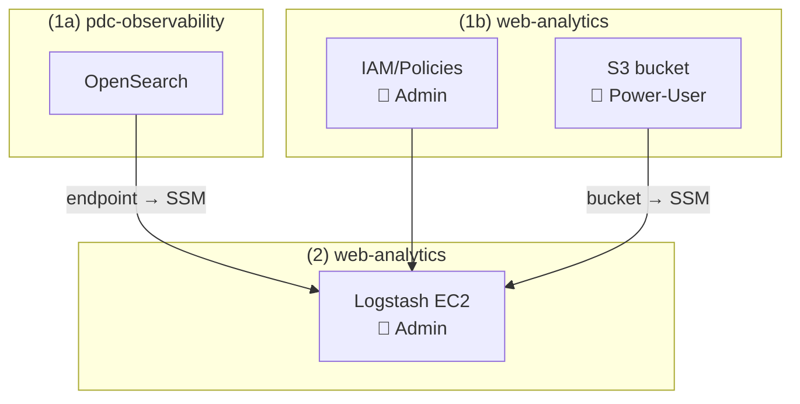

# PDS Web Analytics — Terraform

Deploys the infrastructure for the PDS Web Analytics pipeline:

- **S3 bucket** — log storage (versioning suspended), SSE, and Intelligent-Tiering
- **IAM policy** — grants the Logstash EC2 role read access to S3 and write access to OpenSearch
- **Logstash EC2** — MCP Amazon Linux 2023 instance running Logstash directly via RPM + systemd

> **OpenSearch** is managed separately in [pdc-observability](https://github.com/NASA-PDS/pdc-observability). Deploy it first — the endpoint is published to SSM and consumed automatically here.

```
terraform/
  ├── iam/policies/         # IAM policy + role attachment  — 🔐 admin (iam:CreatePolicy, iam:AttachRolePolicy)
  ├── s3/                   # S3 log bucket
  └── logstash/             # Logstash EC2                   — 🔐 admin (iam:PassRole)
```

---

## Deployment flow



1. **(1a) Deploy OpenSearch** — See [pdc-observability](https://github.com/NASA-PDS/pdc-observability) (~15-20 min)
2. **(1b) While OpenSearch provisions**, Can be run in parallel with (1a):
   - `task iam:deploy VENUE=dev` 🔐 — requires `iam:CreatePolicy`, `iam:AttachRolePolicy`
   - `task s3:deploy VENUE=dev` — creates the log bucket, publishes name to SSM
3. **(2) After all above complete** — `task logstash:deploy VENUE=dev` 🔐 — requires `iam:PassRole`; reads OpenSearch endpoint and bucket name from SSM at plan time

---

## Prerequisites

- [Terraform](https://developer.hashicorp.com/terraform/downloads) >= 1.0
- [Task](https://taskfile.dev) — `brew install go-task/tap/go-task`
- AWS CLI + [Session Manager plugin](https://docs.aws.amazon.com/systems-manager/latest/userguide/session-manager-working-with-install-plugin.html) — `brew install --cask session-manager-plugin`
- AWS credentials exported:
  ```bash
  eval $(aws configure export-credentials --profile <your-profile> --format env)
  ```

---

## Setup

### 1. Create tfvars files

All tfvars are gitignored. Copy the examples and fill in values:

```bash
cd terraform/

# Shared values for root + IAM modules (aws_region, tenant, partition, s3_bucket_prefix, etc.)
cp tfvars/common.tfvars.example             tfvars/common-dev.tfvars
# Edit common-dev.tfvars: set managedby, resource_prefix, ec2_role_name

# Module-specific venue values
cp s3/tfvars/dev.tfvars.example                     s3/tfvars/dev.tfvars
cp iam/policies/tfvars/dev.tfvars.example           iam/policies/tfvars/dev.tfvars
cp logstash/tfvars/dev.tfvars.example               logstash/tfvars/dev.tfvars
```

Key values to fill in:

| File | Variable | Notes |
|---|---|---|
| `tfvars/common-dev.tfvars` | `managedby` | Your email address |
| `tfvars/common-dev.tfvars` | `resource_prefix`, `ec2_role_name` | `resource_prefix` drives IAM policy names; EC2 is named `pds-web-analytics` (from `component`) |
| `s3/tfvars/dev.tfvars` | `s3_bucket_prefix` | S3 bucket name; may include CI/CD identifiers |
| `iam/policies/tfvars/dev.tfvars` | `logs_s3_bucket_name` | Full S3 bucket name for the IAM policy resource ARN |
| `logstash/tfvars/dev.tfvars` | `vpc_id`, `ec2_security_group_name`, `s3_cf_bucket_name` | VPC and CloudFront bucket for the EC2 |

### 2. Configure credentials

```bash
eval $(aws configure export-credentials --profile <your-profile> --format env)
unset AWS_PROFILE  # required for Terraform S3 backend compatibility
```

---

## Deployment — step by step

### Step 0: OpenSearch domain — pdc-observability repo

Deploy from the [pdc-observability](https://github.com/NASA-PDS/pdc-observability) repo first. The endpoint is published to SSM automatically and consumed here at plan time.

---

### Step 1: S3 bucket — 🔑 Power-User

```bash
task s3:plan   VENUE=dev
task s3:deploy VENUE=dev
```

---

### 🔐 Step 2: IAM policy — admin only

Requires `iam:CreatePolicy` and `iam:AttachRolePolicy`. Must be run by a system administrator.

```bash
task iam:plan   VENUE=dev
task iam:deploy VENUE=dev
```

---

### 🔐 Step 3: Logstash EC2 — admin only

Requires `iam:PassRole`. Must be run by a system administrator. Run after Steps 0–2.

```bash
task logstash:plan   VENUE=dev
task logstash:deploy VENUE=dev
```

---

### Step 4: Initialize Logstash on the EC2

On **new EC2 deployments**, the userdata script runs `logstash-init.sh` automatically at first boot.

For an **already-running EC2** (e.g., after recreating the OpenSearch domain), SSM in and re-run the init script:

```bash
# SSM into the EC2
aws ssm start-session \
  --target $(aws ssm get-parameter \
    --name /pds/web-analytics/ec2/logstash_instance_id \
    --query Parameter.Value --output text)

# On the EC2 — fetch the latest init script directly from GitHub and run it.
# The script clones (or updates) the full repo itself.
sudo bash <(curl -fsSL https://raw.githubusercontent.com/NASA-PDS/web-analytics/main/scripts/logstash-init.sh)
```

The script will:
1. Clone/update the web-analytics repo to `/opt/web-analytics`
2. Copy Logstash pipeline config to `/opt/logstash/config`
3. Build `pipelines.yml` and `pipelines/*.conf` from templates
4. Apply the OpenSearch ECS index template to the new domain
5. Update `/etc/systemd/system/logstash.service` with the current OpenSearch endpoint from SSM
6. Restart the Logstash systemd service

> **Sincedb (S3 read position):** Each S3 input has a named sincedb file in `/var/lib/logstash/plugins/inputs/s3/` that tracks which objects have been read. Files are named after the input ID (e.g., `sincedb_file_input_naif1`).
>
> Reset all nodes to re-ingest everything from scratch:
> ```bash
> sudo systemctl stop logstash
> sudo rm -f /var/lib/logstash/plugins/inputs/s3/sincedb_*
> sudo systemctl start logstash
> ```
>
> Reset a single node (e.g., NAIF only):
> ```bash
> sudo systemctl stop logstash
> sudo rm -f /var/lib/logstash/plugins/inputs/s3/sincedb_file_input_naif*
> sudo systemctl start logstash
> ```
>
> Leave sincedb intact if you only want to process new S3 objects going forward.

**Tail logs and verify startup:**
```bash
sudo journalctl -u logstash -f
```

A healthy startup looks like this (in order):
```
Starting Logstash ...
Log4j configuration path used is: /etc/logstash/log4j2.properties
Pipelines running {:count=>8, :running_pipelines=>[:atm, :en, :geo, ...]}
```

Once running, you should see S3 polling activity within a minute or two:
```
[logstash.inputs.s3] Providing file ... {:key=>"path/to/logfile.gz"}
```

To confirm events are landing in OpenSearch, run a quick count from the EC2:
```bash
# Get credentials and endpoint
SSM_PARAMETER_NAME=/pds/foo/bar/endpoint
eval $(aws configure export-credentials --format env)
ENDPOINT=$(aws ssm get-parameter --name $SSM_PARAMETER_NAME \
  --region us-west-2 --query Parameter.Value --output text)

# Count documents indexed today
curl -s -X GET "https://${ENDPOINT}/pds-*/_count" \
  --aws-sigv4 "aws:amz:us-west-2:es" \
  --user "${AWS_ACCESS_KEY_ID}:${AWS_SECRET_ACCESS_KEY}" \
  -H "x-amz-security-token: ${AWS_SESSION_TOKEN}" | python3 -m json.tool
```

**Bad logs** (failed grok parsing) are written to `/tmp/bad_logs_YYYY-MM.txt` on the EC2:
```bash
tail -f /tmp/bad_logs-$(date +%Y-%m).txt
```

---

### Step 5: Smoke test

SSM into the EC2 and run:

```bash
bash /opt/web-analytics/scripts/smoke-test.sh
```

Checks S3 access, OpenSearch network reachability, OpenSearch SigV4 auth, and Logstash service status. OpenSearch `status=green` is expected; `yellow` is acceptable on a single-node dev cluster (no replicas).

---

### Step 6 (optional): Grant Logstash access to CloudFront logs bucket

Required only if ingesting CloudFront logs. Apply in the `pdc-cds-infra` repo:

```bash
cd pdc-cds-infra/terraform/cloudfront/pds-main/
# Fill in tfvars/dev.tfvars: web_analytics_ec2_role_name, firehose_pds_main_cf_role_name
task plan   VENUE=dev
task deploy VENUE=dev
```

---

## Updating Logstash configuration

The init script is idempotent — re-running it pulls the latest repo, redeploys config, rebuilds pipelines, and restarts Logstash. This is the standard workflow for config changes:

1. Edit files under `config/logstash/config/` locally
2. Test locally: `docker compose run --rm test`
3. Push to your branch
4. SSM into the EC2 and re-run the init script:

```bash
aws ssm start-session \
  --target $(aws ssm get-parameter \
    --name /pds/web-analytics/ec2/logstash_instance_id \
    --query Parameter.Value --output text)

# On the EC2:
sudo curl -fsSL https://raw.githubusercontent.com/NASA-PDS/web-analytics/main/scripts/logstash-init.sh \
  -o /tmp/logstash-init.sh
sudo bash /tmp/logstash-init.sh
```

> If deploying from a non-`main` branch during active development:
> ```bash
> sudo REPO_BRANCH=terraform bash /tmp/logstash-init.sh
> ```

Common files to edit:
| File | Purpose |
|---|---|
| `config/logstash/config/shared/pds-filter.conf` | Log parsing, field mapping, enrichment |
| `config/logstash/config/shared/pds-output-opensearch.conf` | OpenSearch index/routing settings |
| `config/logstash/config/inputs/pds-input-s3-<node>.conf` | Per-node S3 prefix and metadata |
| `config/logstash/config/logstash.yml` | JVM, queue, pipeline settings |
| `config/logstash/config/plugins/regexes.yaml` | User-agent regex patterns (see below) |

#### Updating `regexes.yaml`

The `regexes.yaml` file is sourced from [ua-parser/uap-core](https://github.com/ua-parser/uap-core/blob/master/regexes.yaml) and provides the regex patterns used by the `logstash-filter-useragent` plugin to detect browsers, bots, and operating systems.

This file should be updated periodically (a few times per year) to pick up new browser and bot signatures:

```bash
curl -fsSL https://raw.githubusercontent.com/ua-parser/uap-core/master/regexes.yaml \
  -o config/logstash/config/plugins/regexes.yaml
```

Then test, commit, and redeploy via the standard config-update workflow above.

---

## Teardown

```bash
task logstash:destroy   VENUE=dev   # Logstash EC2 + launch template  🔐 admin
task iam:destroy        VENUE=dev   # IAM policy + role attachment     🔐 admin
task s3:destroy         VENUE=dev   # S3 bucket (does not delete objects)
```

OpenSearch teardown is managed in [pdc-observability](https://github.com/NASA-PDS/pdc-observability).

---

## Architecture notes

- **State files** stored in S3 (`pds-<venue>-<cicd>-infra`):
  - `web-analytics/s3.tfstate` — S3 log bucket
  - `web-analytics/iam-policies.tfstate` — IAM policies
  - `web-analytics/logstash.tfstate` — Logstash EC2
  - `observability/opensearch.tfstate` — OpenSearch domain (managed in pdc-observability, own bucket/key)
- **Variable naming** — `s3_bucket_prefix` is for the S3 bucket name only (may include CI/CD identifiers like `gh01dc`). `resource_prefix` is for all other resources and should not include CI/CD identifiers.
- **VPC/SG values** are in tfvars. TODO: source from SSM under `/pds/cds-infra/vpc/` once published.
- **Logstash sincedb** persists to `/var/lib/logstash/plugins/inputs/s3/` on the EC2 EBS volume (`delete_on_termination = false`) — S3 read position survives restarts and redeployments.
- **OpenSearch** is managed in [pdc-observability](https://github.com/NASA-PDS/pdc-observability). The endpoint is published to SSM at `/pds/observability/opensearch/opensearch_endpoint` and consumed automatically at plan time.
